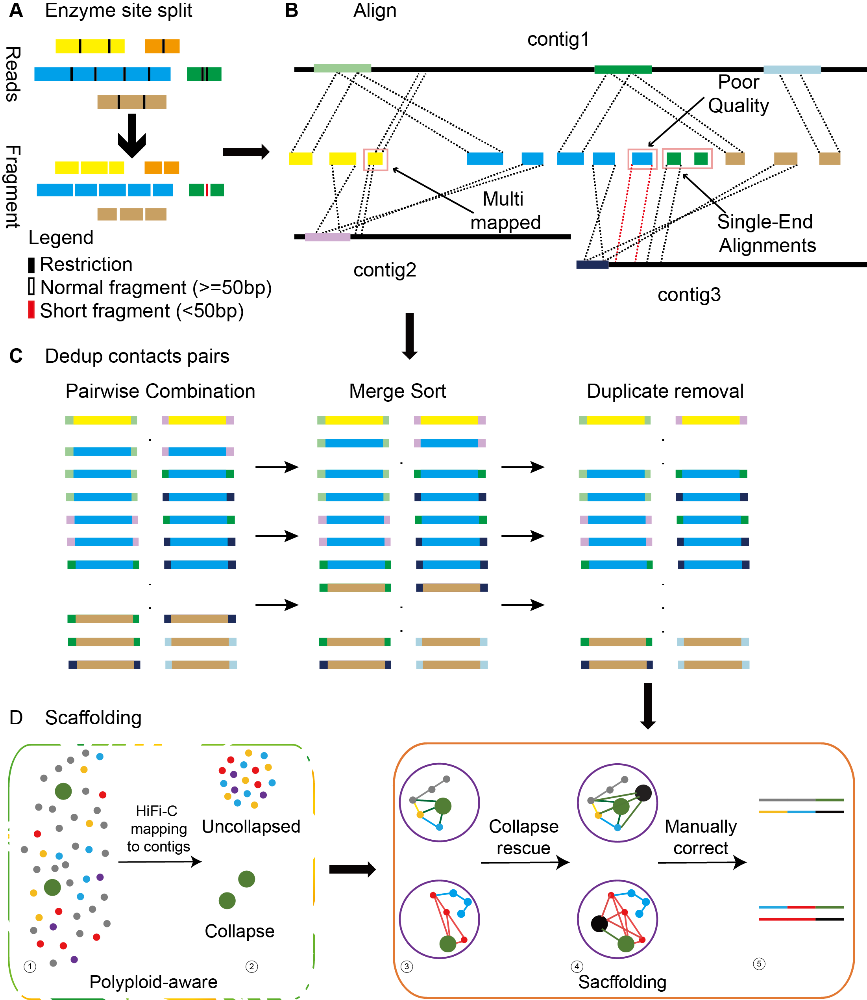

## HAST : HiFi-C Accelerated Scaffolding Tool

## <span id="Introduction">Introduction</span>
&emsp;&emsp;As an emerging high-resolution long-read chromosome conformation capture technique, HiFi-C currently lacks dedicated software tools. Researchers have to adapt pipelines designed for Pore-C, which may underestimate the true potential of HiFi-C data and negatively impact downstream analyses such as scaffolding. To address this issue, we have developed `HAST`, a tool specifically designed for efficient scaffolding using HiFi-C data. `HAST` also supports Pore-C data.

## <span id="Overview">Overview</span>
&emsp;&emsp;Given the substantial length of HiFi-C reads, we employed an analysis strategy involving in silico fragmentation at restriction enzyme cleavage sites prior to alignment.


## Table of contents
- [Dependencies](#Dependencies)
- [Installation](#installation)
- [Quick start](#quick_start)
- [Comparison](#comparison)
- [Output File](#output)
- [Order and orient whole chromosomes using a reference genome](#refsort)
- [Visualization and Final genome](#visualization)
- [Get help](#help)
- [Citating](#Citaing)

## <span id="Dependencies">Dependencies</span>
Software:
- [python >=3.7](https://www.python.org/)
- [pigz](http://zlib.net/pigz/)
- [minimap2](https://github.com/lh3/minimap2)
- [seqkit](https://bioinf.shenwei.me/seqkit)
- [3d-dna](https://github.com/aidenlab/3d-dna)
- [parallel](https://www.gnu.org/software/parallel)
- [juicebox](https://github.com/aidenlab/Juicebox)
- [mummer](https://github.com/mummer4/mummer)

## <span id="Installation">Installation</span>

HAST has been tested and validated on servers running Linux.
```bash
# (1) Download HAST from GitHub
$ git clone https://github.com/zskey-zn/HAST.git
# (2) Resolve dependencies
# We strongly recommend using conda to install dependencies. 
$ conda env create -f environment.yml
# Activate the HapHiC conda environment
$ conda activate hast # or: source /path/to/conda/bin/activate hast
# (3) Install 3d-dna
$ git clone https://github.com/aidenlab/3d-dna.git
#Give executable permissions
$ cd 3d-dna
$ chmod +x  *.sh */*
```

## <span id="quick_start">Quick start</span>

```bash
usage_example: HiFi-C_pipeline.sh -r PATH/contig.fa -i PATH/HiFi-C.fq.gz -p '-x map-hifi' -t 30 -c 10000 -e GATC -d PATH/3d-dna -o your_species

options:
  -h, --help           show this help message and exit
  -r, --ref            contig genome
  -i, --fq_in          <fastq file>  HiFi-C/Pore-C data
  -p, --map_params     <minimap2 align parameter> (if your data is Pore-C,set "-x map-ont" )
  -t, --threads        number of threads
  -c, --chunk_size     Number of records per processing chunk, If the dataset is large, you can increase the `chunk_size` parameter.
  -e, --enzyme_site    Enzyme recognition site: GATC (MboI/DpnII), AAGCTT (HindIII), CATG(NlaIII)
  -d, --_3ddna_path    3ddna software path
  -o, --output_prefix  output prefix
  -a, --polyploid      Enable polyploid mode can rescue collapsed contigs  (default: disabled)
```
##<span id="comparison">Comparison</span>
The following table summarizes a performance comparison of HAST against other tools (wf-pore-c and Cphasing) across various biological datasets, detailing metrics such as valid reads, processing time, and memory usage.

<table style="width: 100%; table-layout: fixed; border-collapse: collapse;">
  <colgroup>
    <col style="width: 18%">
    <col style="width: 16%">
    <col style="width: 12%">
    <col style="width: 12%">
    <col style="width: 8%">
    <col style="width: 8%">
    <col style="width: 8%">
  </colgroup>
  <thead>
    <tr>
      <th style="padding: 8px; text-align: left; border-bottom: 2px solid #ddd;">Dataset</th>
      <th style="padding: 8px; text-align: left; border-bottom: 2px solid #ddd;">Software</th>
      <th style="padding: 8px; text-align: right; border-bottom: 2px solid #ddd;">Dedup valid reads</th>
      <th style="padding: 8px; text-align: right; border-bottom: 2px solid #ddd;">Pairs number</th>
      <th style="padding: 8px; text-align: right; border-bottom: 2px solid #ddd;">Contacts/reads</th>
      <th style="padding: 8px; text-align: left; border-bottom: 2px solid #ddd;">Wall time</th>
      <th style="padding: 8px; text-align: left; border-bottom: 2px solid #ddd;">RAM</th>
    </tr>
  </thead>
  <tbody>
    <tr>
      <td rowspan="3" style="padding: 8px; text-align: left; vertical-align: top; white-space: nowrap;"><a href="https://www.ncbi.nlm.nih.gov/sra/ERR14654081" target="_blank">Ceratitis_capitata</a></td>
      <td style="padding: 8px; text-align: left; white-space: nowrap;">HAST</td>
      <td style="padding: 8px; text-align: right;">1,185,394</td>
      <td style="padding: 8px; text-align: right;">11,508,130</td>
      <td style="padding: 8px; text-align: right;">8.75</td>
      <td style="padding: 8px; text-align: left;">32min</td>
      <td style="padding: 8px; text-align: left;">42G</td>
    </tr>
    <tr>
      <td style="padding: 8px; text-align: left; white-space: nowrap;">wf-pore-c</td>
      <td style="padding: 8px; text-align: right;">1,163,280</td>
      <td style="padding: 8px; text-align: right;">3,264,519</td>
      <td style="padding: 8px; text-align: right;">2.48</td>
      <td style="padding: 8px; text-align: left;">2.5h</td>
      <td style="padding: 8px; text-align: left;">39G</td>
    </tr>
    <tr>
      <td style="padding: 8px; text-align: left; white-space: nowrap;">Cphasing</td>
      <td style="padding: 8px; text-align: right;">1,015,477</td>
      <td style="padding: 8px; text-align: right;">5,888,352</td>
      <td style="padding: 8px; text-align: right;">4.48</td>
      <td style="padding: 8px; text-align: left;">48min</td>
      <td style="padding: 8px; text-align: left;">42G</td>
    </tr>
    <tr>
      <td rowspan="3" style="padding: 8px; text-align: left; vertical-align: top; white-space: nowrap;"><a href="https://www.ncbi.nlm.nih.gov/sra/ERR14654111" target="_blank">Anopheles_coluzzii</a></td>
      <td style="padding: 8px; text-align: left; white-space: nowrap;">HAST</td>
      <td style="padding: 8px; text-align: right;">2,282,982</td>
      <td style="padding: 8px; text-align: right;">64,712,163</td>
      <td style="padding: 8px; text-align: right;">27.35</td>
      <td style="padding: 8px; text-align: left;">1.2h</td>
      <td style="padding: 8px; text-align: left;">70G</td>
    </tr>
    <tr>
      <td style="padding: 8px; text-align: left; white-space: nowrap;">wf-pore-c</td>
      <td style="padding: 8px; text-align: right;">2,159,056</td>
      <td style="padding: 8px; text-align: right;">9,216,303</td>
      <td style="padding: 8px; text-align: right;">3.90</td>
      <td style="padding: 8px; text-align: left;">3.5h</td>
      <td style="padding: 8px; text-align: left;">65G</td>
    </tr>
    <tr>
      <td style="padding: 8px; text-align: left; white-space: nowrap;">Cphasing</td>
      <td style="padding: 8px; text-align: right;">2,258,817</td>
      <td style="padding: 8px; text-align: right;">50,310,732</td>
      <td style="padding: 8px; text-align: right;">21.27</td>
      <td style="padding: 8px; text-align: left;">1.2h</td>
      <td style="padding: 8px; text-align: left;">67G</td>
    </tr>
    <tr>
      <td rowspan="3" style="padding: 8px; text-align: left; vertical-align: top; white-space: nowrap;"><a href="https://www.ncbi.nlm.nih.gov/sra/ERR14275147" target="_blank">Homo_sapien</a></td>
      <td style="padding: 8px; text-align: left; white-space: nowrap;">HAST</td>
      <td style="padding: 8px; text-align: right;">9,198,589</td>
      <td style="padding: 8px; text-align: right;">720,830,448</td>
      <td style="padding: 8px; text-align: right;">78.28</td>
      <td style="padding: 8px; text-align: left;">1d5h</td>
      <td style="padding: 8px; text-align: left;">147G</td>
    </tr>
    <tr>
      <td style="padding: 8px; text-align: left; white-space: nowrap;">wf-pore-c</td>
      <td style="padding: 8px; text-align: right;">8,743,704</td>
      <td style="padding: 8px; text-align: right;">46,912,773</td>
      <td style="padding: 8px; text-align: right;">5.09</td>
      <td style="padding: 8px; text-align: left;">1d7h</td>
      <td style="padding: 8px; text-align: left;">61G</td>
    </tr>
    <tr>
      <td style="padding: 8px; text-align: left; white-space: nowrap;">Cphasing</td>
      <td style="padding: 8px; text-align: right;">9,144,776</td>
      <td style="padding: 8px; text-align: right;">364,842,740</td>
      <td style="padding: 8px; text-align: right;">39.62</td>
      <td style="padding: 8px; text-align: left;">17.9h</td>
      <td style="padding: 8px; text-align: left;">128G</td>
    </tr>
    <tr>
      <td rowspan="3" style="padding: 8px; text-align: left; vertical-align: top; white-space: nowrap;"><a href="https://www.ncbi.nlm.nih.gov/sra/SRR29580843" target="_blank">Plecia_longiforceps</a></td>
      <td style="padding: 8px; text-align: left; white-space: nowrap;">HAST</td>
      <td style="padding: 8px; text-align: right;">15,223,238</td>
      <td style="padding: 8px; text-align: right;">143,783,824</td>
      <td style="padding: 8px; text-align: right;">6.03</td>
      <td style="padding: 8px; text-align: left;">4.7h</td>
      <td style="padding: 8px; text-align: left;">96G</td>
    </tr>
    <tr>
      <td style="padding: 8px; text-align: left; white-space: nowrap;">wf-pore-c</td>
      <td style="padding: 8px; text-align: right;">13,474,187</td>
      <td style="padding: 8px; text-align: right;">35,116,293</td>
      <td style="padding: 8px; text-align: right;">1.47</td>
      <td style="padding: 8px; text-align: left;">11.2h</td>
      <td style="padding: 8px; text-align: left;">86G</td>
    </tr>
    <tr>
      <td style="padding: 8px; text-align: left; white-space: nowrap;">Cphasing</td>
      <td style="padding: 8px; text-align: right;">12,793,521</td>
      <td style="padding: 8px; text-align: right;">69,399,906</td>
      <td style="padding: 8px; text-align: right;">2.91</td>
      <td style="padding: 8px; text-align: left;">3.8h</td>
      <td style="padding: 8px; text-align: left;">88G</td>
    </tr>
    <tr>
      <td rowspan="3" style="padding: 8px; text-align: left; vertical-align: top; white-space: nowrap;"><a href="https://www.ncbi.nlm.nih.gov/sra/SRR28905076" target="_blank">Rosa_hybrida</a></td>
      <td style="padding: 8px; text-align: left; white-space: nowrap;">HAST</td>
      <td style="padding: 8px; text-align: right;">13,338,018</td>
      <td style="padding: 8px; text-align: right;">539,607,578</td>
      <td style="padding: 8px; text-align: right;">37.38</td>
      <td style="padding: 8px; text-align: left;">16.2h</td>
      <td style="padding: 8px; text-align: left;">82G</td>
    </tr>
    <tr>
      <td style="padding: 8px; text-align: left; white-space: nowrap;">wf-pore-c</td>
      <td style="padding: 8px; text-align: right;">10,956,145</td>
      <td style="padding: 8px; text-align: right;">37,981,725</td>
      <td style="padding: 8px; text-align: right;">2.63</td>
      <td style="padding: 8px; text-align: left;">1d2h</td>
      <td style="padding: 8px; text-align: left;">53G</td>
    </tr>
    <tr>
      <td style="padding: 8px; text-align: left; white-space: nowrap;">Cphasing</td>
      <td style="padding: 8px; text-align: right;">7,846,147</td>
      <td style="padding: 8px; text-align: right;">53,071,524</td>
      <td style="padding: 8px; text-align: right;">3.68</td>
      <td style="padding: 8px; text-align: left;">5.6h</td>
      <td style="padding: 8px; text-align: left;">71G</td>
    </tr>
  </tbody>
</table>

## <span id="output">Output Files</span>
Primary Output Files and Their Specifications

```
.
├── 02.paf2mnd
│   ├── your_species.mnd.sort.txt
│   ├── your_species.mnd.txt
│   ├── dups.txt
│   ├── merged_nodups.txt  #nodups mnd file
│   └── tmp
├── 03.3ddna
│   ├── contig.0.asm
│   ├── contig.0_asm.scaffold_track.txt
│   ├── contig.0_asm.superscaf_track.txt
│   ├── contig.0.cprops
│   ├── contig.0.assembly  #Input of Juicebox to manually correct
│   ├── contig.0.hic       #Input of Juicebox to manually correct
│   ├── contig.cprops
│   └── contig.mnd.txt  
└── read.summary          #reads mapping stat
```
## <span id="refsort">Order and orient whole chromosomes using a reference genome</span>
HAST has introduced a separate pipeline to order and orient whole chromosomes according to a reference genome.

To begin, you should get draft chromosomes genome by `.assembly` file which is juicebox manually corrected.
```bash
#set chromosome num
$ chr_num=3
#Can get contig.0.review.fasta(draft chromosomes genome) and contig.0.review.order(Genome-contig correspondence table).
$ python3 /path/to/HAST/script/ass2fasta.py --assembly contig.0.review.assembly --ref contig.fa -n $chr_num
#If don't have closely related chromosomes genome, can sort in descending order by Chromosome length by adding "--sort" parameter，will obtain the contig.0.review_sort.assembly file(sorted assembly file) as an additional output.
$ python3 /path/to/HAST/script/ass2fasta.py --assembly contig.0.review.assembly --ref contig.fa -n $chr_num --sort
```

Then use [mummer](https://github.com/mummer4/mummer) align draft chromosomes genome to  a chromosome-level reference genome. The reference genome can be from the same species or a closely related one:
```bash
$ ref=/path/to/closely_related.genome.fa
$ query=contig.0.review.fasta
$ prefix=your_species
$ nucmer --mum -l 100 -c 1000 -D 5 -t 16 $ref $query -p $prefix  # *** you should change the paramenter when your genome is too large ,like  -l 500
$ delta-filter  ${prefix}.delta -1 > ${prefix}.best.delta  # if has noisy ,you can add -i -o -l paramenter ,like  -i 95 -o 95 -l 150
$ mummerplot -p $prefix -f ${prefix}.best.delta -t postscript
$ show-coords -THrd ${prefix}.best.delta > ${prefix}.best.delta.coord
$ /usr/bin/ps2pdf ${prefix}.ps ${prefix}.pdf
#Generate the correspondence table(correspond_table), can fixed by ${prefix}.pdf
$ python3 /path/to/HAST/script/mummer2table.py -i ${prefix}.best.delta.coord
```

Finally, generate the final file based on the correspondence table.
```bash
$ python3 /path/to/HAST/script/chrom_correspond.py --correspond-table correspond_table --review-assembly contig.0.review.assembly --output-assembly contig.0.correspond.assembly
```

## <span id="visualization">Visualization and Final genome</span>


Generate highly customizable contact maps and Final genome
```bash
$ correspond_assembly=contig.0.correspond.assembly
$ mnd_path=/path/02.paf2mnd/merged_nodups.txt
$ resolution=500000
$ sample_name=your_species
$ chr_count=3
$ _3ddna_path=/path/to/3d-dna
$ python3 /path/to/HAST/script/post_review.py -r contig.fa -a ${correspond_assembly} -e ${resolution} -m ${mnd_path} -c ${chr_count} -s${sample_name} --3ddna_path ${_3ddna_path}
```

Primary Output Files and Their Specifications
```
.
├── your_species.fasta        #Final genome
├── your_species.order        #Genome-contig correspondence table
├── your_species_chrom.fasta  #Final genome(Only Chromosome part)
├── your_species_chrom.order  #Chromosome-contig correspondence table(Only Chromosome part)
├── new_mnd_and_visualizer.sh #Script which generate new hic file 
├── your_species.hic          #new hic file
├── hic_viewer.sh             #Script which plot contact maps
└── your_species.pdf          #Contact maps
```

The blurriness of the heatmap can be mitigated by lowering the `-r` parameter in the `new_mnd_and_visualizer.sh` script to generate new `your_species.hic` file, then generate new contact maps
```bash
#Fixed (-r) parameter in new_mnd_and_visualizer.sh
$ sh new_mnd_and_visualizer.sh
#Can set new resolution(-rslu) to generate new contact maps; 
$ python3 /path/to/HAST/script/hic_viewer.py --hicfile your_species.hic --ref your_species_chrom.fasta --rslu 100000 --outpfix your_species --norm KR
$ Also can change normalization method. choices from 'KR', 'VC', 'VC_SQRT' and 'NONE'
$ python3 /path/to/HAST/script/hic_viewer.py --hicfile your_species.hic --ref your_species_chrom.fasta --rslu 100000 --outpfix your_species --norm VC
```

## <span id="help">Get help</span>
### Help
Feel free to raise an issue at the [isssue page](https://github.com/zskey-zn/HAST/issues)

`Note:` Please ask questions on the issue page first. They are also helpful to other users.
### Contact
For addtional help, please send an email to zhengshang@frasergen.com

## <span id="Citaing">Citating</span>
If you use HAST in your work,please cite:

